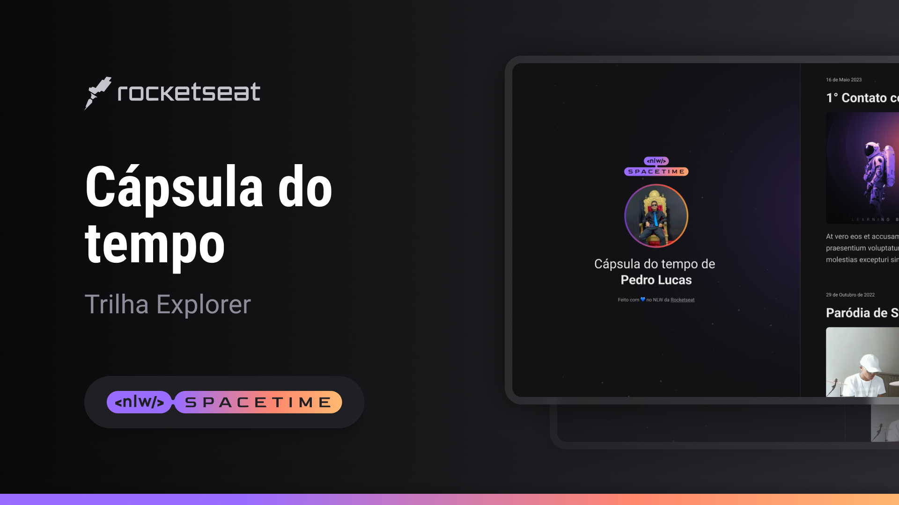

  

## 🖥️ Projeto

Este é um projeto Web Responsivo de uma cápsula do tempo para exibir memórias em uma linha do tempo.

## 🚀 Tecnologias

Este projeto foi desenvolvido durante o NLW da Rocketseat com as seguintes tecnologias:

- HTML
- CSS
- Git e Github

## 🏷️ Layout

Você pode visualizar o layout do projeto através
[deste link](<https://www.figma.com/file/Dqx0Eip7oElPoy1lkEjHoX/C%C3%A1psula-do-tempo-%E2%80%A2-Trilha-Explorer-(Community)?type=design&t=jO1LUQU1GT3V5477-1>).
É necessário ter uma conta no [Figma](https://www.figma.com)
